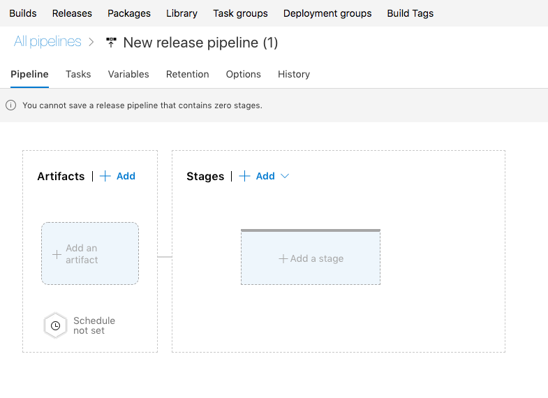
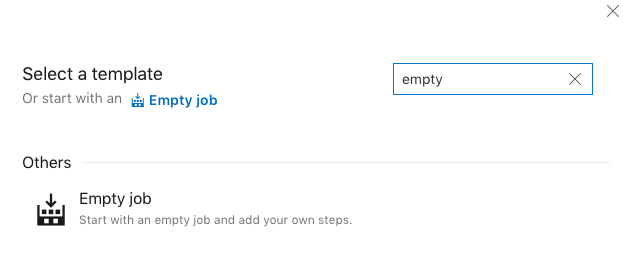
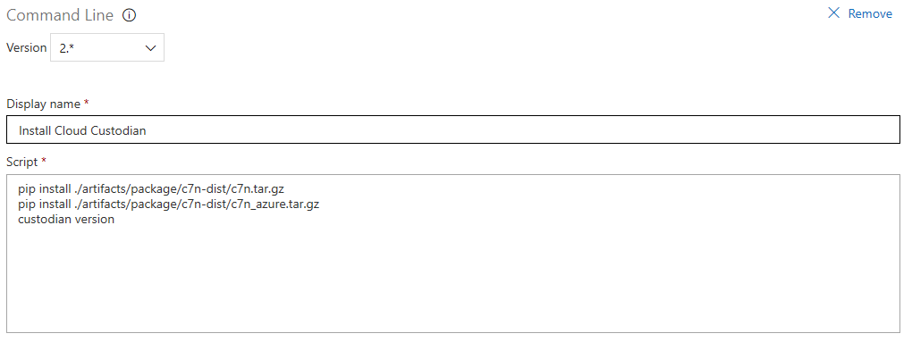

# Release Design

## Release Setup

1. Create a new release

    

2. Connect the build artifact. This will take artifacts published by a build pipeline, which contain the Cloud Custodian policies and policy runner that we plan on deploying. The `Source alias` is the root directory of the build package, which we will call `artifacts`.

    

3. Add the following release variables, which the release tasks will reference. This will contain information such as file paths, Key Vault names, service connection names, and other information we will consume during the release. Use the same `service connection name` previously setup during the build.

    ```
    cloudCustodianCommit : <commit hash from azure-pipelines.yml>
    configFilePath : ./artifacts/package/policies/config.json
    keyVaultName : <key vault name>
    outputPath : azure://<storage_account>.blob.core.windows.net/custodianlogs
    policyFilePath : ./artifacts/package/policies/policies.release.json
    policyRunnerFile : ./artifacts/package/policy_runner.py
    secretsFilter : CustodianReleaseServicePrincipal
    serviceConnectionAzureSubscription : <service connection name>
    ```

    

4. Add a new release stage and select empty job. We will fill this out throughout the guide.

    

5. Ensure that our build stage is using the `Hosted Ubuntu 1604` build image.

    

6. Add a task to use a Python version. Ensure that the Python version is `3.6`.

    

7. Cloud Custodian requires a `Service Principal` to modify Azure Resources. We previously stored this release service principal in Azure Key Vault during setup called `CustodianReleaseServicePrincipal`. To access this Key Vault, we previously established a service connection. Set this Azure Subscription and pull the keys from Key Vault.

    

8. Install the necessary tools for installing custodian

    ```
    python -m pip install --upgrade pip setuptools wheel
    ```

    

9. Install Cloud Custodian by using the same git commit hash as listed in the `azure-pipelines.yml` file. The commit hash is to ensure we're testing with the same version of Cloud Custodian as the build.

    ```
    git clone https://github.com/capitalone/cloud-custodian -n &&
    cd cloud-custodian &&
    git checkout $(cloudCustodianCommit) &&
    cd .. &&
    pip install ./cloud-custodian &&
    pip install ./cloud-custodian/tools/c7n_azure
    ```

    

10. Deploy your validated policies that were packaged in your artifact by using the `policyRunnerFile`. This will ensure that your policies are deployed on Azure Functions and logs are stored on your specified storage account. Ensure your release is saved by clicking the `save` button before leaving.

    ```
    Script path: $(policyRunnerFile)
    Arguments: -c $(configFilePath) -p $(policyFilePath) -s $(CustodianReleaseServicePrincipal) -o $(outputPath)
    ```

    